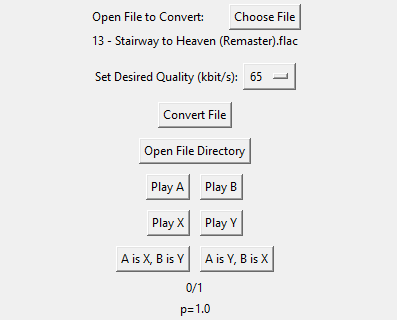

# ABX Audio Test

## Overview
This application is a Python-based tool that uses Tkinter for the GUI. It is designed to perform ABX tests on audio files of different qualities. The purpose of the test is to compare two versions of an audio file (A and B) against a third one (X) and statistically analyze if there is a perceivable difference. The application calculates a p-value based on the user's input to quantify the statistical significance of the results.
## Dependencies
- ffmpeg (https://ffmpeg.org/)
## Usage
1. Start the application
2. Choose an audio file
3. Select the quality of the converted file
4. Click on the "Convert File" button
5. Listen to the audio files A, B, X, and Y
6. Choose either "A is X, B is Y" or "A is Y, B is X"